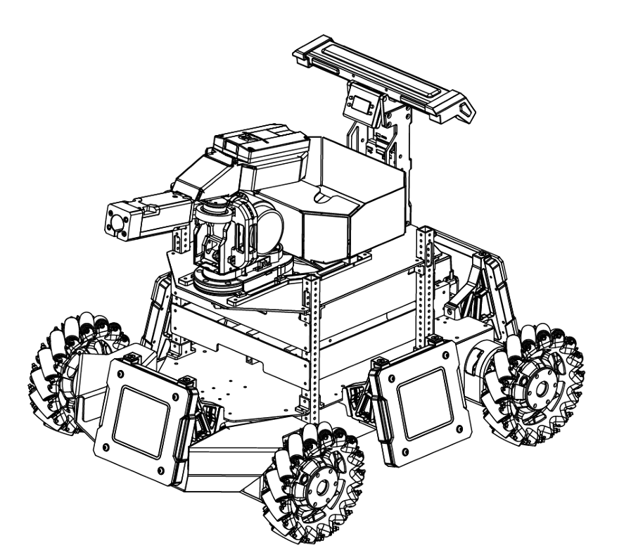

# 数组
## 基本概念

## 声明
int array[5];

## 初始化
int array[5]={0,1,2,3,4};//完全初始化
int array[5]={0,1,2};//部分初始化

## 数组越界
array[0]
array[5]

## 数组访问
int first=array[0];
int second=array[1];
int i=array[i-1];

int *ptr=array;
int first=*ptr;
int second=*(ptr+1);
int i=*(ptr+i-1);

## 多维数组
int a[2][3]=
{{1,2,3}
{4,5,6}};

## for循环
for(i=0;i<5;i++)
{
    printf("%d",array[i]);
    scanf("%d",&array[i]);
}

## 数组与函数结合
int printArray(int *array)
{
    for(int i=0;i<5;i++)
    {
        printf("%d",array[i]);
    }
}

# 指针
## 定义
## 声明
int *ptr;
## 取地址符&/解引用符*
int num=10;
int *ptr=&num;
int value= *ptr;

## 数组与指针
## 传递指针
## 指针与结构体
typedef struct
{
    int x;
    int y;
}point_t;

void set_point(point_t *point,int a,int b)
{
    point->x=a;
    point->y=b;
}

